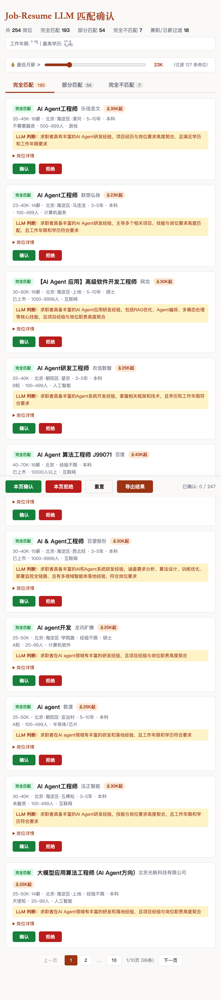

# ohmyboss — BOSS直聘自动化求职管线

> BOSS Zhipin Automation Pipeline: Scrape → Clean → Match → Greet

[](https://python.org)
[](https://deepseek.com)
[](https://github.com)

---

## 目录 | Table of Contents

- [前置条件 | Prerequisites](#前置条件)
- [快速开始 | Quick Start](#快速开始)
- [架构概览 | Architecture Overview](#架构概览)
- [四阶段管线 | Four-Stage Pipeline](#四阶段管线)
- [项目结构 | Project Structure](#项目结构)
- [核心设计决策 | Key Design Decisions](#核心设计决策)
- [模块依赖图 | Module Dependency Graph](#模块依赖图)
- [Token 预算 | Token Budget](#token-budget)
- [License](#license)
- [致谢 | Acknowledgments](#致谢--acknowledgments)

---

## 前置条件

### 系统依赖

- Python 3.10+
- 虚拟环境 (`.venv`)
- Chrome/Chromium（供 CloakBrowser 使用）
- [Claude Code](https://claude.ai/code)（CLI 环境）

## 快速开始

**方法一：让 Claude 自行安装**

将本 README 链接发给 Claude Code，Claude 会自动识别并安装所需 skills：

```
请根据这个项目配置你的 skills：https://github.com/jijeng/ohmyboss/blob/main/README.md
```

**方法二：手动拷贝**


### 0. 安装 Claude Code Skills
```bash
# 将 skills 目录下所有 skill 拷贝到 Claude Code 配置目录
git clone https://github.com/jijeng/ohmyboss.git
cd ohmyboss && cp -r skills/* ~/.claude/skills/
```

### 1. 环境初始化

运行 claude 之后，使用以下命令安装坏境

```
ohmyboss-setup
```

### 2. 完整管线（四阶段依次执行）

```bash
# Step 1: 抓取职位（以 AI Agent 为例）
/ohmyboss-scrape 关键词:"AI Agent" 城市:北京,上海,深圳,杭州

# Step 2: 清洗过滤
/ohmyboss-clean

# Step 3: 简历匹配
/ohmyboss-match

# Step 4: 查看匹配结果，在 match_review.html 中标记 accept/reject

# Step 5: 自动打招呼（只对 accept 的岗位）
/ohmyboss-greeter
```

### 单独使用某个阶段

每个阶段可以独立运行，只需确保上游数据文件存在：

```bash
/ohmyboss-scrape 关键词:"Python开发" 城市:北京         # 只抓取
/ohmyboss-clean --input data/python_dev_jobs.json       # 只清洗
/ohmyboss-match --input data/python_dev_jobs_cleaned.json  # 只匹配
/ohmyboss-greeter                                       # 只打招呼
```

---


### API 配置

在 `.env` 文件中配置：

```bash
DEEPSEEK_API_KEY=sk-xxxxx     # DeepSeek API Key（match + greeter 共用）
DEEPSEEK_BASE_URL=https://api.deepseek.com
DEEPSEEK_MODEL=deepseek-chat
```

### 简历

将简历放在 `resume/resume.md`（Markdown 格式），供 match 和 greeter 阶段使用。

---

## 架构概览

ohmyboss 是一个四阶段自动化求职管线，从抓取BOSS直聘职位数据开始，到过滤、匹配、自动打招呼为止，全流程覆盖。

**核心数据流**：`scrape → clean → match → greeter`

```
┌──────────────┐    ┌──────────────┐    ┌──────────────┐    ┌──────────────┐
│ ohmyboss-    │    │ ohmyboss-    │    │ ohmyboss-    │    │ ohmyboss-    │
│ scrape       │───▶│ clean        │───▶│ match        │───▶│ greeter      │
│ 职位抓取      │    │ 数据清洗      │    │ 简历匹配      │    │ 自动打招呼    │
└──────────────┘    └──────────────┘    └──────────────┘    └──────────────┘
      │                   │                    │                    │
      ▼                   ▼                    ▼                    ▼
  data/*_jobs.json   data/*_cleaned.json   match_result_llm.json  greet_history.json
```

**共享基础设施**（三组跨模块复用）：

| 子系统 | 使用者 | 说明 |
|--------|--------|------|
| Cookie 持久化 (`~/.config/boss_zhipin_cookies.json`) | scraper + greeter | Cookie 一次登录，两个模块复用 |
| DeepSeek API (`deepseek-v3`) | match + greeter | 同一 API，match 做简历-职位语义匹配，greeter 做招呼语生成 |
| CloakBrowser 反检测 | scraper + greeter | 绕过BOSS直聘反爬/风控检测 |

---

## 四阶段管线

### Phase 1: `ohmyboss-scrape` — 职位抓取

使用 CloakBrowser 反检测浏览器抓取 BOSS直聘职位数据。

**能力**：
- 多关键词拓展搜索（自动生成近义词组合拓宽覆盖面）
- 触底滚动翻页（自动加载列表页所有卡片）
- 全局去重（按 `link` 字段跨关键词去重）
- 渐进式限流恢复（详情页遇到限流自动递增等待时间）

**输出**：`data/{keyword}_{city}_jobs.json`

```
触发词：抓取boss、抓取岗位、boss直聘抓取、爬取boss
```

### Phase 2: `ohmyboss-clean` — 数据清洗

根据可配置规则过滤不合适的职位，输出保留数据和被过滤数据（含命中原因）。

**六条清洗规则**：

| 规则 | 函数 | 默认阈值 |
|------|------|---------|
| 公司名不详 | `check_vague_company()` | 名称含"某"/"匿名"等模糊词 |
| 实习/校招/高级管理 | `check_exclude_keywords()` | 实习生、校招、总监、VP等 |
| 成立<2年 | `check_founded_lt_2y()` | 成立时间不足2年 |
| 微型早期初创 | `check_reject_micro_early()` | 融资天使轮且人数<20 |
| 外包/驻场 | `check_outsourcing()` | 公司名含"外包"/"驻场"/"外派" |
| 工时红线 | `check_overtime_redline()` | JD含"996"/"大小周"/"单休" |

**关键设计**：多规则命中策略 — 所有规则都执行但只计一次过滤，空值字段不触发对应规则避免误杀。

**输出**：`data/{keyword}_jobs_cleaned.json` + `data/{keyword}_rejected.json`

```
触发词：清洗boss、清洗数据、boss数据清洗、职位清洗
```

### Phase 3: `ohmyboss-match` — 简历匹配

用 DeepSeek API 对清洗后的岗位与简历进行语义匹配，三分类判定。

**匹配标准**：
- **完全匹配** (full match)：技能对齐 ≥80%，经验匹配
- **部分匹配** (partial match)：部分技能对齐，可尝试投递
- **完全不匹配** (no match)：技能不相关

**能力**：
- 批量3并发 LLM 调用加速匹配
- 生成交互式 HTML 确认页面（薪资滑块 + 分页 + 批量操作）
- 简历关键信息提取（个人总结 + 项目经验 + 技能关键词）


*交互式匹配确认页面：薪资滑块筛选、分页浏览、批量 accept/reject 操作 | Interactive match review page: salary slider, pagination, batch accept/reject*

**输出**：`data/match_result_llm.json` + `data/match_decisions.json` + `match_review.html`

```
触发词：匹配岗位、岗位匹配、简历匹配、job match
```

### Phase 4: `ohmyboss-greeter` — 自动打招呼

加载已 accept 的岗位，逐岗位打开详情页 → LLM 生成定制招呼语 → 发送。

**安全机制**：
- 登录态检测（Cookie 复用）
- 风控识别（每日限额/安全验证/异常页面）
- 历史去重（`greet_history.json`，同一岗位不重复打招呼）
- 速率控制（随机间隔 + 人工行为模拟）

**人工行为模拟**（反检测核心）：
- 4段贝塞尔曲线模拟鼠标移动
- 随机滚动 + 随机停顿
- 打字速度随机化

**输出**：`data/greet_history.json` + `data/greetings.jsonl`

```
触发词：打招呼、自动打招呼、boss打招呼、批量打招呼
```

---

## 项目结构

```
.
├── README.md                           # 本文件
├── skills/
│   ├── ohmyboss-scrape/
│   │   ├── SKILL.md                    # 抓取技能定义
│   │   └── scraper.py                  # 主抓取脚本 (350+ 行)
│   ├── ohmyboss-clean/
│   │   ├── SKILL.md                    # 清洗技能定义
│   │   └── boss_cleaner.py             # 清洗脚本 (300+ 行)
│   ├── ohmyboss-match/
│   │   ├── SKILL.md                    # 匹配技能定义
│   │   └── boss_matcher_llm.py         # LLM匹配脚本 (400+ 行)
│   ├── ohmyboss-greeter/
│   │   ├── SKILL.md                    # 打招呼技能定义
│   │   └── boss_greeter.py             # 自动打招呼脚本 (1300+ 行)
│   └── ohmyboss-setup/
│       └── SKILL.md                    # 环境初始化
├── .claude/
│   └── CLAUDE.md                       # Claude Code 项目配置
├── data/                               # 运行时数据（gitignore）
│   ├── *_jobs.json                     # 抓取原始数据
│   ├── *_cleaned.json                  # 清洗后数据
│   ├── match_result_llm.json           # 匹配结果
│   ├── match_decisions.json            # 用户决策
│   ├── greet_history.json             # 打招呼历史
│   └── greetings.jsonl                # 生成的招呼语
└── resume/
    └── resume.md                       # 用户简历
```

---

## 核心设计决策

这些决策定义了管线的架构 DNA。

| 决策 | 位置 | 理由 |
|------|------|------|
| **多规则命中策略** | ohmyboss-clean | 所有规则都执行、都记录原因，但只计一次过滤。避免单条记录被重复计入 rejected 统计 |
| **空值安全** | ohmyboss-clean | 字段为空时对应规则不触发，避免误杀。例如：融资信息缺失 → 跳过"微型初创"检查，而不是拒绝 |
| **三分类匹配** | ohmyboss-match | 完全/部分/不匹配，而非二元通过/拒绝。部分匹配给用户最终决定权，避免漏掉边界case |
| **Cookie 共享文件** | scraper + greeter | 一次手动登录，两个阶段复用 Cookie，避免重复扫码 |
| **DeepSeek 单 API 双用途** | match + greeter | 同一 API 端点，match 用高 temperature 做分类，greeter 用低 temperature 做话术生成 |
| **渐进式限流恢复** | scraper collect_details | 遇到限流后等待时间递增（指数退避 + 随机抖动），而非固定重试间隔 |
| **4段贝塞尔鼠标轨迹** | greeter human_move | 模拟真实用户鼠标移动，绕过行为检测 |
| **历史去重** | greeter | 持久化记录已打招呼岗位，防止重复发送 |

---

## 模块依赖图

```
                        ┌──────────────────┐
                        │   DeepSeek API    │
                        │  (deepseek-chat)  │
                        └──────┬───────┬────┘
                               │       │
                  ┌────────────┘       └────────────┐
                  ▼                                  ▼
      ┌──────────────────┐              ┌──────────────────┐
      │ ohmyboss-match   │              │ ohmyboss-greeter │
      │ 简历匹配 (3并发)   │              │ 招呼语生成         │
      └────────┬─────────┘              └────────┬─────────┘
               │                                 │
               │  ┌──────────────────────────────┘
               │  │
               ▼  ▼
      ┌──────────────────┐
      │ Shared Cookie    │
      │ (~/.config/...)  │
      └────────┬─────────┘
               │
    ┌──────────┴──────────┐
    ▼                     ▼
┌────────────┐    ┌──────────────┐
│ scraper    │    │ greeter      │
│ 抓取       │    │ CloakBrowser │
│ CloakBrowser│   │ 交互         │
└─────┬──────┘    └──────┬───────┘
      │                  │
      ▼                  ▼
┌────────────┐    ┌──────────────┐
│ ohmyboss-  │    │ Human Move   │
│ clean      │    │ Utils        │
│ 清洗过滤    │    │ 贝塞尔/随机    │
└────────────┘    └──────────────┘
```

### God Nodes（关键中枢函数）

| 函数 | 连接数 | 社区桥接 | 角色 |
|------|--------|---------|------|
| `process_single_job()` | 17 | 5 个社区 | 单岗位完整打招呼流程编排器 |
| `main()` (greeter) | 14 | 4 个社区 | 打招呼主流程入口 |
| `log()` | 12 | 2 个社区 | 全局日志（被所有函数调用） |
| `clean_record()` | 8 | 2 个社区 | 清洗规则执行中枢 |
| `match_jobs_llm()` | 5 | 2 个社区 | LLM匹配批处理入口 |

---

## Token 预算

| 阶段 | LLM 调用 | 预估 Token/次 |
|------|---------|-------------|
| scrape | 无 | 0 |
| clean | 无（规则引擎） | 0 |
| match | DeepSeek API × N个岗位 | ~500 tokens/岗位 |
| greeter | DeepSeek API × M个accept岗位 | ~300 tokens/岗位 |

---

## License

MIT

---

## 致谢 | Acknowledgments

本项目受以下开源项目启发，感谢他们的先行探索：

- [boss-autogreet](https://github.com/imwyvern/boss-autogreet) — BOSS直聘自动化打招呼工具
- [boss-zhipin-skill](https://github.com/TreeWalk/boss-zhipin-skill) — BOSS直聘 Claude Code Skill

---

*如果你的求职之路也依赖这条管线，不妨给它一个 ⭐*
*If this pipeline helps your job hunt, consider giving it a ⭐*
